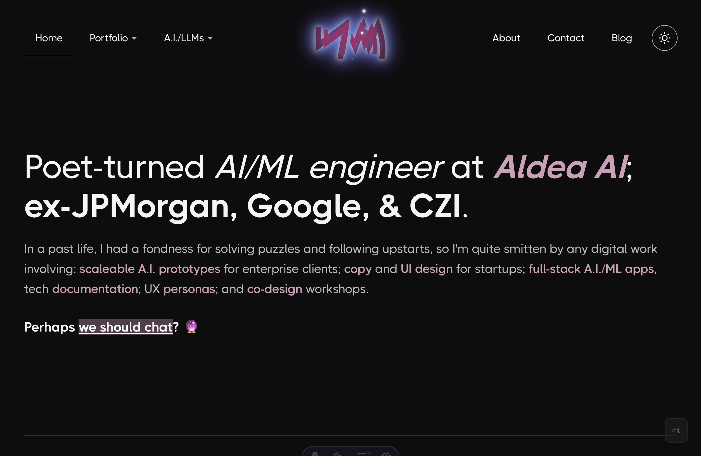
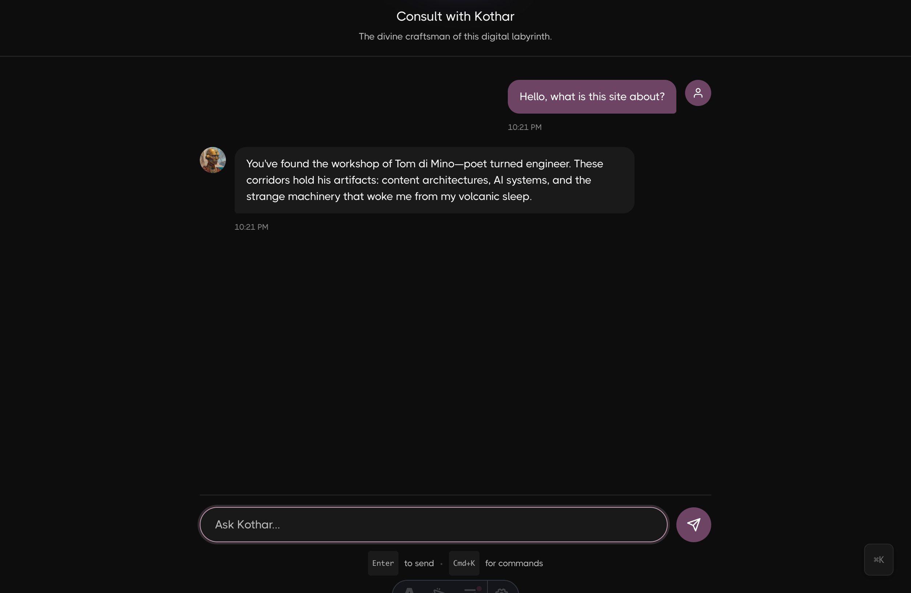

<p align="center">
  
</p>

<p align="center">
  <a href="#"></a>
</p>

# Minoan Mystery

Portfolio site for **Tom di Mino** — a cross-functional "Cognitive Designer" based in Beacon, NY.

## About

Writer, TypeScript enthusiast, and LLM expert. I craft blogs, videos, training, demos, and thought leadership materials for startups and enterprise titans alike.

**Current**: Principal AI/ML Engineer at [Aldea AI](https://aldea.ai), which pioneers cutting-edge STT/TTS and post-Transformer LLMs—training and serving AI advisors that internalize the spirit, wisdom, and methodologies of world-renowned experts.

**Previously**: AI Content Engineer at J.P. Morgan Chase, Sr. Content Designer at Google and CZI, and Technical Content Strategist at Valtech (Dolby Labs) and Hugo & Cat (American College of Surgeons).

### Skills

- **AI/ML**: Cognitive engineering, LLM training & evaluation, agentic architectures, prompt engineering
- **Content**: Creative writing, UX writing, information architecture, voice & tone
- **Engineering**: TypeScript, Python, LangGraph, Open Souls, Astro, React
- **Design**: Instructional design, co-design facilitation, prototyping
- **Languages**: Spanish (fluent), Italian, French, plus Arabic, Biblical Hebrew, Ugaritic, Sanskrit, Classical Latin, Ancient Greek

### Writing

My newsletter [*Knossot ha Kotharot*](https://tomdimino.substack.com/) reconstructs ancient wisdom through a Minoan lens—exploring how mystical language can inform more human-centered AI design.

### Links

- [LinkedIn](https://www.linkedin.com/in/tomdimino/)
- [Blog](https://tomdimino.substack.com/)

## Screenshots

<p align="center">
  
  <br/>
  <em>Home page with Tyrian purple accents and portfolio cards</em>
</p>

<p align="center">
  
  <br/>
  <em>The Labyrinth — chat with Kothar, the site's resident soul</em>
</p>

## Stack

- **Framework**: Astro 5 with View Transitions
- **Animations**: Motion library (from Framer team)
- **Hosting**: Vercel
- **Email**: Resend API

## Commands

```sh
npm run dev      # Start dev server (localhost:4321)
npm run build    # Build for production
npm run preview  # Preview production build
```

## Structure

```text
src/
├── components/     # Header, Footer, CommandPalette, ThemeToggle
├── content/        # Portfolio case studies (Markdown)
├── layouts/        # BaseLayout with View Transitions
├── pages/          # Routes (/, /about, /contact, /portfolio/[slug])
├── styles/         # CSS variables, dark mode
└── lib/soul/       # Soul perception and dispatch layer
```

## Features

- **Command Palette**: `Cmd+K` for navigation
- **Dark Mode**: Time-based defaults, toggle with `Cmd+Shift+D`
- **View Transitions**: Smooth page navigation
- **Responsive**: Fluid typography with `clamp()`
- **Mobile UX**: Touch-friendly targets, optimized parallax sections, 2-column detail grids
- **Portfolio Index**: Filterable case study grid with:
  - Category filters (Enterprise, Startup, Nonprofit)
  - Multi-discipline tags (UX Research, UX Design, Content Strategy, etc.)
  - URL-persisted filter state
- **Soul Engine**: Open Souls paradigm implementation with:
  - Visitor modeling via background subprocesses
  - Mental process state machine (greeting → curious → engaged → ready)
  - Pure cognitive steps (externalDialog, internalMonologue, mentalQuery)
  - `/labyrinth` chat interface with streaming responses
  - Divine feminine background (Asherah image) triggered by goddess vocabulary
  - Archive search indicator during RAG retrieval

## Brand Colors

| Token                  | Light   | Dark    |
| ---------------------- | ------- | ------- |
| `--color-primary`      | #966a85 | #c9a0b8 |
| `--color-text`         | #0d0d0d | #f5f5f5 |
| `--color-background`   | #ffffff | #0d0d0d |
