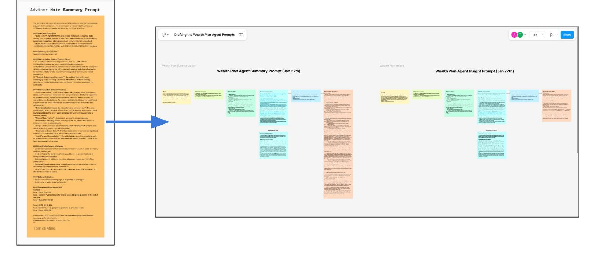
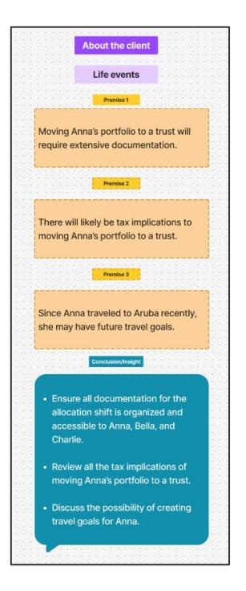
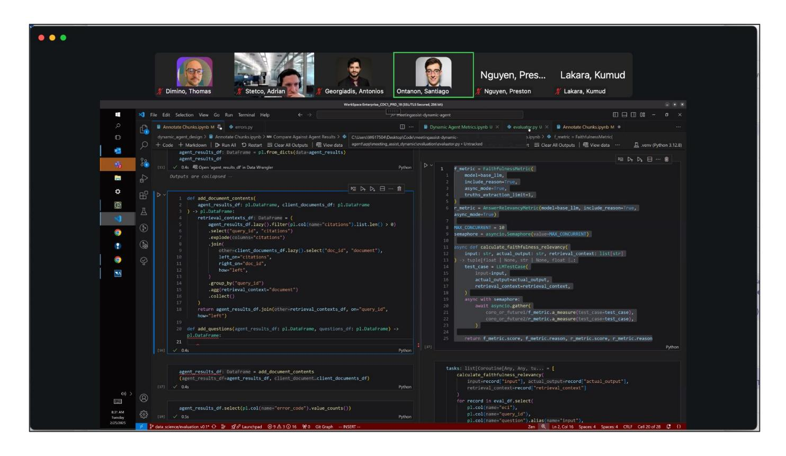

# *Content Engineering* for JPMorgan

Or how I steered AI product development, and established new methodologies to launch a "Meeting Assist" in Wealth Management that's now saving the firm up to **\$800k a day**.

As a **Content Engineer**, I'm the guy who's closest to the prompts behind our AI tool called "Meeting Assist."

By virtue of my past experiences building AI demos, I also contribute to the design of our 'agentic' architecture, and the ways in which we measure our LLMs' outputs.

My work spans UX research, design, data, ML, dev, and product teams.

JPMC employs **5000+ wealth advisors** overseeing **\$***1 trillion* **in assets** from primarily 'high-net worth clients.' Each advisor meets with **1-2 clients a day**, and between **300-400 a year.**

In the lead-up to meetings, advisors have practically no time to find all their client notes, absorb them, and come prepped with **salient summaries** and insightful **talking points**.

Wealth advisors want a "*virtual assistant that they can trust,*" one that understands their goals: *deepening relationships,* and *conversion of prospects*.

## JPMC wanted its "Meeting Assist" built and piloted **within 5 months.**

| FOR JPMC INTERNAL USE ONLY - RID content is not for distribution or discussion with any external recipients, clients, prospects, etc. Images on the page are hypothetical and for informational purposes only. Screen images are skrszlated. Cecilia Simon ECI 1234567890 · Preferred name Cecilia · WM client since Jul 5, 2022 · CCB client since Sep 12, 2017 · Last meeting date with advisor Nov 11, 2023 Read last meeting notes > Personal details Wealth Management Banking Nicolas Simon (Age 39) Spouse Risk profile \$30,013 Moderate Checking Charles Simon (Age Children Planning Yes Savings \$270,800 $\overline{2}1$ \$150,000 / \$370,000 Premium credit card \$6,000 Qualified / non-qualified <b>Beneficiary</b> Nicolas Simon (100%) Income \$210,000 <b>Basis</b> credit card \$450 Shadow (French Bulldoz) Per Reminders <b>C</b> Reminders C Remind Cecilia to set up a travel goal Suggest refinancing on Cecilia's home Charles' 3rd birthday is on December 11, 2023. Cecilia used her credit card to purchase six flights in 2023. Due to excellent credit, she qualifies for a lower mortgage. Follow up about vacation plans Suggest short-term market funds Tell Cecilia she's pre-approved for an auto loan Nicolas received a promotion and bonus in May. We spoke Cecilia has \$50,000 in idle cash in her checking account. During a previous joint meeting. Nicolas mentioned that about using it for a vacation. Cecilia wanted to purchase a new electric vehicle. Was this helpful? (C) c'o Servicing rep Digital Advisor Banker Troy Jones Katherine Smith 4 meetings in the last 12 months 6 calls in the last 12 months 4 logins this month New 09, 2023 Oct 17, 2023 New 25, 2023 Cocilia came in to talk about upgrading her Called to review paperwork for a transfer from Cocilia couldn't transfer money from her Vanguard that is not in good order. checking account to Premium Banking. Investment account to her checking account 3 times using the bank's mobile app. Oct 27, 2023 Oct 01, 2023 Sep 20, 2023 Cecilia exceeded the wire transfer limit when Called to add Nicolas as her beneficiary of her she sent money for her sister's wedding in This week. Cecilia started and didn't finish the investment accounts. Italy. Discussed next steps. Investing account opening process a few times online. Was this helpful? (C) (C) | Cecilia Simon's annual review Generated lan 25, 2024 at 3:30 PM | About Certifia | <b>Key relationship insights</b> <b>Engagement summary</b> | Financial planning | Accounts and portfolio Research |
|--------------------------------------------------------------------------------------------------------------------------------------------------------------------------------------------------------------------------------------------------------------------------------------------------------------------------------------------------------------------------------------------------------------------------------------------------------------------------------------------------------------------------------------------------------------------------------------------------------------------------------------------------------------------------------------------------------------------------------------------------------------------------------------------------------------------------------------------------------------------------------------------------------------------------------------------------------------------------------------------------------------------------------------------------------------------------------------------------------------------------------------------------------------------------------------------------------------------------------------------------------------------------------------------------------------------------------------------------------------------------------------------------------------------------------------------------------------------------------------------------------------------------------------------------------------------------------------------------------------------------------------------------------------------------------------------------------------------------------------------------------------------------------------------------------------------------------------------------------------------------------------------------------------------------------------------------------------------------------------------------------------------------------------------------------------------------------------------------------------------------------------------------------------------------------------------------------------------------------------------------------------------------------------------------------------------------------------------------------------------------------------------------------------------------------------------------------------------------------------------------------------------------------------------------------------------------------------------------------------------------------------------------------|--------------------------------------------------------------------|----------------|---------------------------------------------------------------|--------------------|------------------------------------|
| Cocilia has one son, Charles, who will be turning 3 in December. She enjoys hiking, wine and playing tennis with her husband, Nicolas. They have one dog, Shadow. Cocilia often travels with her husband and child (at least 2 or 3 times a year). Her main focus is making the most of her money when traveling and planning for her son's education at a private bilingual school. Cecilia and Nicolas plan to retire early so they can travel full-time. Key relationships insights                                                                                                                                                                                                                                                                                                                                                                                                                                                                                                                                                                                                                                                                                                                                                                                                                                                                                                                                                                                                                                                                                                                                                                                                                                                                                                                                                                                                                                                                                                                                                                                                                                                                                                                                                                                                                                                                                                                                                                                                                                                                                                                                                        |                                                                    |                |                                                               |                    |                                    |
|                                                                                                                                                                                                                                                                                                                                                                                                                                                                                                                                                                                                                                                                                                                                                                                                                                                                                                                                                                                                                                                                                                                                                                                                                                                                                                                                                                                                                                                                                                                                                                                                                                                                                                                                                                                                                                                                                                                                                                                                                                                                                                                                                                                                                                                                                                                                                                                                                                                                                                                                                                                                                                                        |                                                                    |                |                                                               |                    |                                    |
|                                                                                                                                                                                                                                                                                                                                                                                                                                                                                                                                                                                                                                                                                                                                                                                                                                                                                                                                                                                                                                                                                                                                                                                                                                                                                                                                                                                                                                                                                                                                                                                                                                                                                                                                                                                                                                                                                                                                                                                                                                                                                                                                                                                                                                                                                                                                                                                                                                                                                                                                                                                                                                                        |                                                                    |                |                                                               |                    |                                    |
| Nev 11, 2023                                                                                                                                                                                                                                                                                                                                                                                                                                                                                                                                                                                                                                                                                                                                                                                                                                                                                                                                                                                                                                                                                                                                                                                                                                                                                                                                                                                                                                                                                                                                                                                                                                                                                                                                                                                                                                                                                                                                                                                                                                                                                                                                                                                                                                                                                                                                                                                                                                                                                                                                                                                                                                           |                                                                    |                |                                                               |                    |                                    |
| Reminders Co Follow up with Cecilia about birthday plans 3 meetings in the last 12 months. Discussed progress toward Cecilia's retirement goal and helped her create a 529 plan in Connecticut for her son, Charles, Aug 17, 2023 Cecilia was worried about the markets. Gave her talking points from LTCMA 2023 and research about market volatility.                                                                                                                                                                                                                                                                                                                                                                                                                                                                                                                                                                                                                                                                                                                                                                                                                                                                                                                                                                                                                                                                                                                                                                                                                                                                                                                                                                                                                                                                                                                                                                                                                                                                                                                                                                                                                                                                                                                                                                                                                                                                                                                                                                                                                                                                      |                                                                    |                |                                                               |                    |                                    |
|                                                                                                                                                                                                                                                                                                                                                                                                                                                                                                                                                                                                                                                                                                                                                                                                                                                                                                                                                                                                                                                                                                                                                                                                                                                                                                                                                                                                                                                                                                                                                                                                                                                                                                                                                                                                                                                                                                                                                                                                                                                                                                                                                                                                                                                                                                                                                                                                                                                                                                                                                                                                                                                        |                                                                    |                |                                                               |                    |                                    |
|                                                                                                                                                                                                                                                                                                                                                                                                                                                                                                                                                                                                                                                                                                                                                                                                                                                                                                                                                                                                                                                                                                                                                                                                                                                                                                                                                                                                                                                                                                                                                                                                                                                                                                                                                                                                                                                                                                                                                                                                                                                                                                                                                                                                                                                                                                                                                                                                                                                                                                                                                                                                                                                        |                                                                    |                |                                                               |                    |                                    |
|                                                                                                                                                                                                                                                                                                                                                                                                                                                                                                                                                                                                                                                                                                                                                                                                                                                                                                                                                                                                                                                                                                                                                                                                                                                                                                                                                                                                                                                                                                                                                                                                                                                                                                                                                                                                                                                                                                                                                                                                                                                                                                                                                                                                                                                                                                                                                                                                                                                                                                                                                                                                                                                        |                                                                    |                |                                                               |                    |                                    |
|                                                                                                                                                                                                                                                                                                                                                                                                                                                                                                                                                                                                                                                                                                                                                                                                                                                                                                                                                                                                                                                                                                                                                                                                                                                                                                                                                                                                                                                                                                                                                                                                                                                                                                                                                                                                                                                                                                                                                                                                                                                                                                                                                                                                                                                                                                                                                                                                                                                                                                                                                                                                                                                        |                                                                    |                |                                                               |                    |                                    |
|                                                                                                                                                                                                                                                                                                                                                                                                                                                                                                                                                                                                                                                                                                                                                                                                                                                                                                                                                                                                                                                                                                                                                                                                                                                                                                                                                                                                                                                                                                                                                                                                                                                                                                                                                                                                                                                                                                                                                                                                                                                                                                                                                                                                                                                                                                                                                                                                                                                                                                                                                                                                                                                        |                                                                    |                |                                                               |                    |                                    |
|                                                                                                                                                                                                                                                                                                                                                                                                                                                                                                                                                                                                                                                                                                                                                                                                                                                                                                                                                                                                                                                                                                                                                                                                                                                                                                                                                                                                                                                                                                                                                                                                                                                                                                                                                                                                                                                                                                                                                                                                                                                                                                                                                                                                                                                                                                                                                                                                                                                                                                                                                                                                                                                        |                                                                    |                |                                                               |                    |                                    |
|                                                                                                                                                                                                                                                                                                                                                                                                                                                                                                                                                                                                                                                                                                                                                                                                                                                                                                                                                                                                                                                                                                                                                                                                                                                                                                                                                                                                                                                                                                                                                                                                                                                                                                                                                                                                                                                                                                                                                                                                                                                                                                                                                                                                                                                                                                                                                                                                                                                                                                                                                                                                                                                        |                                                                    |                |                                                               |                    |                                    |
| Engagement summary O                                                                                                                                                                                                                                                                                                                                                                                                                                                                                                                                                                                                                                                                                                                                                                                                                                                                                                                                                                                                                                                                                                                                                                                                                                                                                                                                                                                                                                                                                                                                                                                                                                                                                                                                                                                                                                                                                                                                                                                                                                                                                                                                                                                                                                                                                                                                                                                                                                                                                                                                                                                                                        |                                                                    |                |                                                               |                    |                                    |
|                                                                                                                                                                                                                                                                                                                                                                                                                                                                                                                                                                                                                                                                                                                                                                                                                                                                                                                                                                                                                                                                                                                                                                                                                                                                                                                                                                                                                                                                                                                                                                                                                                                                                                                                                                                                                                                                                                                                                                                                                                                                                                                                                                                                                                                                                                                                                                                                                                                                                                                                                                                                                                                        |                                                                    |                |                                                               |                    |                                    |
|                                                                                                                                                                                                                                                                                                                                                                                                                                                                                                                                                                                                                                                                                                                                                                                                                                                                                                                                                                                                                                                                                                                                                                                                                                                                                                                                                                                                                                                                                                                                                                                                                                                                                                                                                                                                                                                                                                                                                                                                                                                                                                                                                                                                                                                                                                                                                                                                                                                                                                                                                                                                                                                        |                                                                    |                |                                                               |                    |                                    |
|                                                                                                                                                                                                                                                                                                                                                                                                                                                                                                                                                                                                                                                                                                                                                                                                                                                                                                                                                                                                                                                                                                                                                                                                                                                                                                                                                                                                                                                                                                                                                                                                                                                                                                                                                                                                                                                                                                                                                                                                                                                                                                                                                                                                                                                                                                                                                                                                                                                                                                                                                                                                                                                        |                                                                    |                |                                                               |                    |                                    |
|                                                                                                                                                                                                                                                                                                                                                                                                                                                                                                                                                                                                                                                                                                                                                                                                                                                                                                                                                                                                                                                                                                                                                                                                                                                                                                                                                                                                                                                                                                                                                                                                                                                                                                                                                                                                                                                                                                                                                                                                                                                                                                                                                                                                                                                                                                                                                                                                                                                                                                                                                                                                                                                        |                                                                    |                |                                                               |                    |                                    |
|                                                                                                                                                                                                                                                                                                                                                                                                                                                                                                                                                                                                                                                                                                                                                                                                                                                                                                                                                                                                                                                                                                                                                                                                                                                                                                                                                                                                                                                                                                                                                                                                                                                                                                                                                                                                                                                                                                                                                                                                                                                                                                                                                                                                                                                                                                                                                                                                                                                                                                                                                                                                                                                        |                                                                    |                |                                                               |                    |                                    |
|                                                                                                                                                                                                                                                                                                                                                                                                                                                                                                                                                                                                                                                                                                                                                                                                                                                                                                                                                                                                                                                                                                                                                                                                                                                                                                                                                                                                                                                                                                                                                                                                                                                                                                                                                                                                                                                                                                                                                                                                                                                                                                                                                                                                                                                                                                                                                                                                                                                                                                                                                                                                                                                        |                                                                    |                |                                                               |                    |                                    |
|                                                                                                                                                                                                                                                                                                                                                                                                                                                                                                                                                                                                                                                                                                                                                                                                                                                                                                                                                                                                                                                                                                                                                                                                                                                                                                                                                                                                                                                                                                                                                                                                                                                                                                                                                                                                                                                                                                                                                                                                                                                                                                                                                                                                                                                                                                                                                                                                                                                                                                                                                                                                                                                        |                                                                    |                |                                                               |                    |                                    |
|                                                                                                                                                                                                                                                                                                                                                                                                                                                                                                                                                                                                                                                                                                                                                                                                                                                                                                                                                                                                                                                                                                                                                                                                                                                                                                                                                                                                                                                                                                                                                                                                                                                                                                                                                                                                                                                                                                                                                                                                                                                                                                                                                                                                                                                                                                                                                                                                                                                                                                                                                                                                                                                        |                                                                    |                |                                                               |                    |                                    |

*The Wealth Management team's proof-of-concept for the AI tool "Meeting Assist." We revisited this POC halfway through development, reviewing what we retained or altered from it.* 

### But **no one** had prompted GPT-4o in an 'agentic' fashion before.

*Raw and unstructured Advisor notes imported from the API. Using Pydantic classes, we specified a structure over all the individual notes, and input them as JSONs into our prompts.*

As the sole **Content Engineer** on my team, who also had ownership over Content Design, I had quite a few responsibilities, some of which included:

- Onboard into Wealth Management (**with no prior exposure to FinTech**), and understand the daily concerns of wealth advisors, as well as the internal platforms they use at JPMC.
- **Define a taxonomy** and dictionary of terms for an AI tool, and collaborate with UX designers and researchers to render this within Figma UIs that could be user-tested regularly.
- Propose an 'agentic' flow for **prompting GPT-4o**, and iterate on the development of said prompts alongside ML engineers, pushing PRs into *LangGraph*-based repos on BitBucket.
- Judge the outputs of our 'agents,' and **automate the evaluation qualitatively** and quantitatively at scale, while reconciling our product vision, LRCC regulations, & advisor feedback.

My team communicated via **Teams** and email, and monitored project tasks in **Jira**. I attended stand-ups, and held 1-on-1's with our product managers, the VP of Content, design, research, data, ML, and devs.

I versioned my work across Excels, Figma, Confluence, and two repos.

|          | 1 Section                       | <b>Subsection</b>                                                                                                                                                                                 | <b>Comments</b>                        | Data sources           |
|----------|---------------------------------|---------------------------------------------------------------------------------------------------------------------------------------------------------------------------------------------------|----------------------------------------|------------------------|
|          | About the client                | 1. Personal profile: Client's age, interests, hobbies, relationship status, life style, employer, status as a renter or home/owner, and occupation                                             |                                        | <b>Notes</b>           |
| 3        |                                 | 2. Life events: Occurences such as marriages, births, deaths, career shifts, and vacations; but all strictly non-financial                                                                     |                                        | <b>Notes</b>           |
|          |                                 | 3. Household information: Client's family members/children and their financial statuses, ages, hobbies, employers, and life styles.                                                            |                                        | Notes + Wealth Plan    |
| 5        |                                 |                                                                                                                                                                                                   |                                        |                        |
|          | About the meeting               | 4. Previous meetings: What was discussed in the last 2-3 meetings or interactions with the client, organized by date                                                                           |                                        | <b>Notes</b>           |
| R        |                                 |                                                                                                                                                                                                   |                                        |                        |
| $\Omega$ | <b>Financial mindset</b>        | 5. Investment profile: Client's risk tolerance, investment history, spending and saving patterns, and financial education (e.g. time horizon, comfort with volatility in the markets, etc.) |                                        | <b>Notes</b>           |
| 10       |                                 | 6. Financial concerns: Concerns the client has expressed related to their banking transactions, activities, and finances which may negatively impact them, and how they were resolved.      |                                        | <b>Notes</b>           |
| 11       |                                 | 7. Priorities review: An examination of the client's stated financial goals. and any progress that's been made toward reaching individual goals                                                |                                        | <b>Notes</b>           |
|          |                                 | 8. Financial habits: Patterns and behaviors related to the client's day-to-day spending, saving, use of financial tools, and education                                                         | Could be split from Investment profile |                        |
|          | Latest Subsections (11-18-2024) | Ideal Sections & Subsections Sample notes Sample banking data                                                                                                                                     | Summaries & Insights (Banking)         | Synthesized Global S & |

*My taxonomy (a set of 3 sections, and 10 subsections) became official early on in "Meeting Assist," guiding the development of our UI prototypes, and the prompts behind our 'agents.'*

All decisions on UX writing within "Meeting Assist" also fell to me.

| +, Al generated content may be incorrect. Please review the information carefully.                                                                                                 | FOR (PMC INTERNAL USE ONLY - IUO content is not for distribution or discussion with any external recipients, clients, prospects, etc. | Generated On 10/31/24 1:54 PM                                                                                                                                                                                                                                                                                                                                           | Next Meeting 10/31/24 4:30 PM |
|------------------------------------------------------------------------------------------------------------------------------------------------------------------------------------|---------------------------------------------------------------------------------------------------------------------------------------|----------------------------------------------------------------------------------------------------------------------------------------------------------------------------------------------------------------------------------------------------------------------------------------------------------------------------------------------------------------------------|----------------------------------|
| <b>About the Client</b>                                                                                                                                                            |                                                                                                                                       |                                                                                                                                                                                                                                                                                                                                                                            | <b>View Sources</b>              |
| <b>Summaries</b>                                                                                                                                                                   | Was this useful?                                                                                                                      | Considerations +                                                                                                                                                                                                                                                                                                                                                           | Was this useful?                 |
| Personal Profile                                                                                                                                                                   |                                                                                                                                       | Personal Profile                                                                                                                                                                                                                                                                                                                                                           |                                  |
| . Aaron has been offered a new position as an Interior Designer at a firm that will provide a 20% pay cut compared to his previous position as a Product Manager at Apple.   | 16                                                                                                                                    | . If Aaron takes a 20% pay cut to switch careers, it's projected he can meet his "Retirement" goal, as well as all other Wealth Plan goals, if he's willing to: · Work 4 additional years and retire in 2047. · Reduce his target retirement income by 15%, allowing him to retire in 2043. · Divert external assets that compensate for a lower fixed income. | 1(R) <b>10</b>                |
| Household information                                                                                                                                                              |                                                                                                                                       | Household Information                                                                                                                                                                                                                                                                                                                                                      |                                  |
| . Aaron's son Frank is slated to start his undergraduate education in Spring of 2025 at University of North Texas, aligned with the "Education" goal in Aaron's Wealth Plan. | 10 de                                                                                                                                 | . Confirm if Frank is still attending University of North Texas. · Aaron's "Education" goal for Frank is 3 months away. He'll need to liquidate up to 14.0% of its allocated equity to cover expenses for his son's first semester.                                                                                                                                  |                                  |
| <b>About the Meeting</b>                                                                                                                                                           |                                                                                                                                       |                                                                                                                                                                                                                                                                                                                                                                            | <b>View Sources</b>              |
| <b>Summaries</b>                                                                                                                                                                   | Was this useful?                                                                                                                      | Considerations +                                                                                                                                                                                                                                                                                                                                                           |                                  |
| Previous Meetings                                                                                                                                                                  |                                                                                                                                       |                                                                                                                                                                                                                                                                                                                                                                            |                                  |
| · On September 12th, 2024, Aaron met with you by phone to discuss his retirement travel plans and the possibility of maximizing his 401(k).                                     | 10 1 16                                                                                                                 |                                                                                                                                                                                                                                                                                                                                                                            |                                  |
|                                                                                                                                                                                    |                                                                                                                                       |                                                                                                                                                                                                                                                                                                                                                                            |                                  |

*After ingesting all of the notes and internal API data we have on a client, we generate a 'one-pager' with vetted summaries and insights organized by their section and subsection.* 

|                                                                                                                                                                                                                                                                                                                                                     |                                                                                                                                                                                                                                                                                                                             | Subsection                               | <b>Summary</b>                                                                                                                                                                                                                                                                                                                                                                                                                                                                                                       | <b>Global Considerations Across Notes and Banking Info</b>                                                                                                                                                                                                                                                                                                                             |  |
|-----------------------------------------------------------------------------------------------------------------------------------------------------------------------------------------------------------------------------------------------------------------------------------------------------------------------------------------------------|-----------------------------------------------------------------------------------------------------------------------------------------------------------------------------------------------------------------------------------------------------------------------------------------------------------------------------|------------------------------------------|----------------------------------------------------------------------------------------------------------------------------------------------------------------------------------------------------------------------------------------------------------------------------------------------------------------------------------------------------------------------------------------------------------------------------------------------------------------------------------------------------------------------|----------------------------------------------------------------------------------------------------------------------------------------------------------------------------------------------------------------------------------------------------------------------------------------------------------------------------------------------------------------------------------------|--|
| Advisor/Banker Notes - Editorial guidelines <b>Editorial guidelines</b> read. <b>Summary</b>                                                                                                                                                                                                                                               | Voice: Use a friendly, natural tone that's conversational yet professional. Adjust your language to be clear and accessible, as if speaking directly to colleagues. Avoid overly formal or lengthy phrasing that may come off as cold or difficult to <b>Insights</b>                                              | Personal profile                         | . %Person2% is an elderly grandmother who may be vulnerable at times: %Person202% is keen to ensure that no one takes advantage of them. . %Person2%'s daughter, %Person202%, usually handles %Person2%'s finances due to their background in finance. while %Person2%'s son, %Person203%, manages issues related to their home. . %Person2% has been a client of Chase since 2010 with multiple checking and savings accounts, and a long-term investor in the market for over 20 years. | . Consider discussing how services can be tailored to support %Person202% in their role of managing their mother's finances and ensuring her needs and wishes are prioritized. . Given %Person2%'s long history with Chase, explore any premium services or loyalty programs suited to their needs as a long-term, high-value client.                                |  |
| · Length: Keep concise, around 3-5 sentences. · Structure: Use bullet points for easy scanning. Content: Focus on key facts, dates, amounts, and actions taken • Clarifications: Include explanatory details in parentheses (e.g. when talking about the client's CDs, "As CDs mature (maturing date 11-6-23, current APY 4%)" | • Format: Present as bulleted list of questions or action items. • Focus: Highlight any areas that need follow- up, clarification, or further discussion. • Depth: Go beyond restating facts to suggest implications or next steps. • Relevance: Should be directly related to the summarized content. | Life events                              | . The funds in %Person2%'s portfolio will be moved to a trust, with all three trustees signing off on it, and the allocation shifted from balanced to conservative. . %Person2% traveled to Aruba last week (9-05-24) and stayed at a hotel, suggesting a vacation.                                                                                                                                                                                                                                      | . Explore the implications of moving %Person2%'s portfolio to a trust, ensuring all trustees, particularly %Person2%, %Person202%, and %Person203%. understand their roles and the impact of this change. . Inquire if %Person2% has any upcoming travel plans, such as family celebrations, that may impact finances.                                                  |  |
| Chronology: Present information in order as it occurred when relevant. Acronyms: Spell out acronyms (and write out acronym in parenthesis) on first-use. Amounts: Write out numbers in full (e.g. "\$5000" instead of "\$5k").                                                                                                       |                                                                                                                                                                                                                                                                                                                             | <b>Household information</b> $\equiv$ | . %Person2% has two children: a daughter (%Person202%) and a son (%Person203%) · %Person2% also has grandchildren. . %Person2% owns multiple assets including a Chase MyHome Loan with a current balance of \$14,224 and a Ideal Sections & Subsections Sample notes Sample banking data                                                                                                                                                                                                              | • Clarify the roles of %Person202% and %Person203% in %Person2%'s financial planning to better understand how decisions are made within the family and ensure everyone has the necessary information. . With only two remaining payments on their MyHome Loan, the client may be able to pay off the remaining Summaries & Insights (Banking) Synthesized Global S & |  |

*Before thinking about any prompting, I defined the voice and tone for our LLM outputs, pulling from JPMC's brand guidelines, Meeting Assist's product specs, and UX research.* 

*By writing "idealized copy" for all the [different subsections](#page-5-0) I previously defined, we were able to test this taxonomy with advisors, and confirm our UI direction.*

|                             | B.                        | $\mathbb{C}$                                                          |                                                                                                                                       |                                        |     |                                       |                       |                                                                                                                                                                                 |                  |                     |
|-----------------------------|---------------------------|-----------------------------------------------------------------------|---------------------------------------------------------------------------------------------------------------------------------------|----------------------------------------|-----|---------------------------------------|-----------------------|---------------------------------------------------------------------------------------------------------------------------------------------------------------------------------|------------------|---------------------|
| 1 Data field                | <b>Subsection</b>         | <b>Example</b>                                                        |                                                                                                                                       |                                        |     |                                       |                       |                                                                                                                                                                                 |                  |                     |
| $2$ Age                     | <b>Personal Profile</b>   |                                                                       |                                                                                                                                       |                                        |     |                                       |                       |                                                                                                                                                                                 |                  |                     |
| 3 Retirement Age            | <b>Personal Profile</b>   |                                                                       | <b>Meeting Assist</b>                                                                                                                 |                                        |     |                                       |                       |                                                                                                                                                                                 |                  |                     |
| 4 Lifestyle                 | Personal Profile          |                                                                       | <b>Aaron Smith</b>                                                                                                                    |                                        |     |                                       |                       |                                                                                                                                                                                 |                  |                     |
| 5 Hobbies                   | Personal Profile          |                                                                       |                                                                                                                                       |                                        |     |                                       |                       |                                                                                                                                                                                 |                  |                     |
| 6 Relationship status       | Personal Profile          |                                                                       | FOR JPMC INTERNAL USE ONLY - IUO content is not for distribution or discussion with any external recipients, clients, prospects, etc. |                                        |     |                                       |                       |                                                                                                                                                                                 | Generated On     | Next Meeting        |
| 7 Homeowner/renter          | <b>Personal Profile</b>   | https://sites.jpmchase.com/:x:/r/sites/JPMWMAICoreGroup/ layouts.     | Al-generated content may be incorrect. Please review the information carefully.                                                       |                                        |     |                                       |                       |                                                                                                                                                                                 | 10/31/24 1:54 PM | 10/31/24 4:30 PM    |
| 8 Occupation/employer       | <b>Personal Profile</b>   |                                                                       |                                                                                                                                       |                                        |     |                                       |                       |                                                                                                                                                                                 |                  |                     |
| 9 Employment income         | <b>Personal Profile</b>   |                                                                       |                                                                                                                                       |                                        |     |                                       |                       |                                                                                                                                                                                 |                  |                     |
| 10 Name                     | Household information     |                                                                       | About the Client                                                                                                                      |                                        |     |                                       |                       |                                                                                                                                                                                 |                  | <b>View Sources</b> |
| 11 Age                      | Household information     |                                                                       |                                                                                                                                       |                                        |     |                                       |                       |                                                                                                                                                                                 |                  |                     |
| 12 State of residence       | Household information     |                                                                       | <b>Household Information</b>                                                                                                          |                                        |     |                                       |                       | <b>Household Information</b>                                                                                                                                                    |                  | Was this useful?    |
| 13 Relationship to client   | Household information     |                                                                       |                                                                                                                                       |                                        |     |                                       |                       |                                                                                                                                                                                 |                  | 甲山                  |
| 14 Employer                 | Household information     |                                                                       | Name                                                                                                                                  | Relationship                           | Age | Retirement Age / Year S.S. Age / Year |                       | <b>Summaries</b>                                                                                                                                                                |                  |                     |
| 15 Hobbies:                 | Household information     |                                                                       | Aaron Smith                                                                                                                           |                                        | 42  | 68 / 2056                             | 67/2056               | · Aaron's son Frank is slated to start his undergraduate education in Spring of 2025 at University of North Texas, aligned with the "Education" goal in Aaron's Wealth Plan. |                  |                     |
| Investment portfolio assets | Investment profile        | "\$1.9 million spread across various acccounts"                       | Frank Smith                                                                                                                           | Son                                    | 19  | 60/2054                               | 67/2064               |                                                                                                                                                                                 |                  |                     |
|                             |                           |                                                                       |                                                                                                                                       |                                        |     |                                       |                       | Considerations                                                                                                                                                                  |                  | 甲油                  |
|                             |                           |                                                                       | <b>Entity name</b>                                                                                                                    |                                        |     | Relationship                          |                       | . Confirm if Frank is still attending University of North Texas.                                                                                                                |                  |                     |
| 16                          |                           |                                                                       |                                                                                                                                       |                                        |     |                                       |                       | . Aaron's "Education" goal for Frank is 3 months away. He'll need to liquidate up to 14.0% of                                                                                   |                  |                     |
|                             |                           |                                                                       | Entity name 1                                                                                                                         |                                        |     | Trust                                 |                       | its allocated equity to cover the expenses for Frank's first semester.                                                                                                          |                  |                     |
|                             |                           |                                                                       | Entity name 2                                                                                                                         |                                        |     | <b>Business</b>                       |                       |                                                                                                                                                                                 |                  |                     |
|                             |                           |                                                                       |                                                                                                                                       |                                        |     |                                       |                       | Personal Profile                                                                                                                                                                |                  | Was this useful?    |
| Investment funding          | Investment profile        | "They have contributed \$26,000 in December 2020, \$5,000 in August   | <b>Investment Profile</b>                                                                                                             |                                        |     |                                       |                       | <b>Summaries</b>                                                                                                                                                                |                  | 甲油                  |
|                             |                           | investment accounts worth \$500,000 in December 2021."                | Information                                                                                                                           |                                        |     | <b>Details</b>                        |                       |                                                                                                                                                                                 |                  |                     |
| 18 Real estate assets       | Investment profile        | "Real estate investments with a net worth of \$1.5 million"           |                                                                                                                                       |                                        |     |                                       |                       | - Aaron has been offered a new position as an Interior Designer at a firm that will provide a 20% pay cut compared to his previous position as a Product Manager at Apple.   |                  |                     |
| 19 Stock purchases          | Investment profile        | "Purchasing \$110.16 worth of FACGX stock"                            | Investment objective                                                                                                                  |                                        |     | Growth                                |                       |                                                                                                                                                                                 |                  |                     |
| 20 401k                     | Investment profile        | "General Motors 401k valued at approximately \$320,000."              | Time horizon                                                                                                                          |                                        |     |                                       | Greater than 10 years | Considerations                                                                                                                                                                  |                  | 甲山                  |
| 21 Annuity                  | Investment profile        | "Has an annuity worth \$40,000 coming due soon."                      | Gross annual income                                                                                                                   |                                        |     | \$650,000                             |                       | · If Aaron takes a 20% pay cut to switch careers, it's projected he can meet his "Retirement"                                                                                   |                  |                     |
| 22 Premium deposit          | <b>Investment</b> profile | "Plans to add \$300,000 to the premium deposit."                      | Net worth (+ External)                                                                                                                |                                        |     | \$812,314.80                          |                       | goal, as well as all other Wealth Plan goals, if he's willing to:                                                                                                               |                  |                     |
| <b>Typical balances</b>     | Investment profile        | "Our investment tools and calculators can help you take control of yo |                                                                                                                                       |                                        |     |                                       |                       | · Work 4 additional years and retire in 2047.                                                                                                                                   |                  |                     |
|                             |                           |                                                                       | Assets                                                                                                                                |                                        |     |                                       |                       | . Reduce his target retirement income by 15%, allowing him to retire in 2043.                                                                                                   |                  |                     |
|                             |                           |                                                                       | Retirement accounts                                                                                                                   |                                        |     | \$211,625.60                          |                       | · Divert external assets that compensate for a lower fixed income.                                                                                                              |                  |                     |
|                             |                           |                                                                       | Real estate (unrealized)                                                                                                              |                                        |     | \$458,719.20                          |                       | - Given that 45% of these assets are external, there may be a variability of -8.2% to +11.4% to                                                                                 |                  |                     |
|                             |                           |                                                                       | Taxable investment accounts                                                                                                           |                                        |     | \$52,906,40                           |                       | Aaron's estimated net worth (\$1,406,738 to \$1,743,132).                                                                                                                       |                  |                     |
|                             |                           |                                                                       |                                                                                                                                       | External investment account (Fidelity) |     | \$388,078,80                          |                       |                                                                                                                                                                                 |                  |                     |
|                             |                           |                                                                       | Cash                                                                                                                                  |                                        |     | \$26,234.80                           |                       |                                                                                                                                                                                 |                  |                     |
|                             |                           |                                                                       | Liabilties                                                                                                                            |                                        |     |                                       |                       |                                                                                                                                                                                 |                  |                     |
|                             |                           |                                                                       | Mortgage                                                                                                                              |                                        |     | \$325,250.00                          |                       |                                                                                                                                                                                 |                  |                     |
|                             |                           |                                                                       |                                                                                                                                       |                                        |     |                                       |                       |                                                                                                                                                                                 |                  |                     |

Given all the client info we had on hand, we needed to differentiate between data that would pass to LLMs for summarization, and data that would appear in static places within the "Meeting Assist" UI. We wrote prompt instructions for the former, and rules-based logic (in Python ) for the latter.

### We validated our early UI designs in 5 rounds of UX research.

*I worked closely with our UX director to ensure that each round of research filled in our knowledge gaps, confirmed what we were currently building, and offered a post-MVP vision for "Meeting Assist" which we could also iterate on.*

*During interviews with advisors, I recorded my notes for each volunteer in Figma, and discussed them in debriefs afterward. At the end of each research round, design and ML would both ask me for my interpretations of it.* 

Parallel to UI design, prompt development went on between myself and the ML team. While most of the versioning occurred in Confluence and BitBucket, I found it useful to break my prompts into individual parts, and color-code them so they could be visualized differently by our larger team.

### Prompt iterations required that we review LLM outputs constantly.

|                                                          |                                  |                                                                                        | $\rho$ rds                                                                                                  |                                                                                                                                                      | 日日田郎     |
|----------------------------------------------------------|----------------------------------|----------------------------------------------------------------------------------------|-------------------------------------------------------------------------------------------------------------|------------------------------------------------------------------------------------------------------------------------------------------------------|----------|
| <b>EXPLORER</b>                                          | {} 0005652417_rds_results.json   | · insight.oy · refresh_insights.py                                                  | {} 0024402658_rds_results.json X                                                                            |                                                                                                                                                      | $m \sim$ |
| $\times$ RDS                                             | () 0024402658 rds results.ison > |                                                                                        |                                                                                                             |                                                                                                                                                      |          |
| Ο                                                        | "nesults": [ R                |                                                                                        |                                                                                                             |                                                                                                                                                      |          |
| (1 0023890773_rds_results.json                           | 162                              |                                                                                        |                                                                                                             |                                                                                                                                                      |          |
| {1 0023890773_rds_validated_summaries.js                 | 165                              | "sub_category": "Financial Concerns",                                                  |                                                                                                             |                                                                                                                                                      |          |
| () 0024141196_rds_input_request_to_merg                  | 166                              |                                                                                        |                                                                                                             | "summary": "In July 2023, George Martin faced issues with monthly fees due to an account linkage error, which were resolved with a refund and proper |          |
| () 0024141196 rds input request.ison                     |                                  |                                                                                        |                                                                                                             | account linkage. 0n March 21, 2023, a representative was unable to upload a Transfer on Death form, but it was resolved by uploading the form on  |          |
| () 0024141196_rds_noncompliant_insights.j                | "references": [ 167           | behalf of the representative.",                                                        |                                                                                                             |                                                                                                                                                      |          |
| (1 0024141196_rds_refreshed_insights.json                | 168                              |                                                                                        |                                                                                                             |                                                                                                                                                      |          |
| () 0024141196_rds_refreshed_summaries_r                  | 169                              |                                                                                        |                                                                                                             | "On July 11, 2023, the client complained about monthly fees due to an account linkage error, which resulted in multiple \$35,00 fees. The fees       |          |
| 冊 () 0024141196 rds validated summaries ison          |                                  | were refunded, and the accounts were properly linked.",                                |                                                                                                             |                                                                                                                                                      |          |
| () 0024402658_rds_input_request_to_mer                   | 170                              |                                                                                        |                                                                                                             |                                                                                                                                                      |          |
| (1 0024402658_rds_input_request.json                     | 171 172                       | "760340dc-2dc5-46da-88d1-b91328edb99d"                                                 |                                                                                                             |                                                                                                                                                      |          |
| (1 0024402658_rds_insights_validated.json                | 173                              |                                                                                        |                                                                                                             |                                                                                                                                                      |          |
| (1 0024402658 rds refreshed insights.json                | 174                              |                                                                                        |                                                                                                             |                                                                                                                                                      |          |
| () 0024402658 rds refreshed summaries                    | 175                              |                                                                                        |                                                                                                             | "On March 21, 2023, a representative was unable to upload a Transfer on Death form, but it was resolved by uploading the form on behalf of           |          |
| () 0024402658 rds results.ison                           | 176                              | the representative.",                                                                  |                                                                                                             |                                                                                                                                                      |          |
| (1 0024402658_rds_validated_summaries.j                  | 177                              | "9f34a076-a985-4cf4-b431-a88ce26364a6"                                                 |                                                                                                             |                                                                                                                                                      |          |
| (1 0027555646 rds_input_request_to_merg_                 | 178                              |                                                                                        |                                                                                                             |                                                                                                                                                      |          |
| () 0027655646_rds_input_request.json                     | 179                              |                                                                                        |                                                                                                             |                                                                                                                                                      |          |
| () 0027555646_rds_insights_validated.json                | 188 ъ.                        |                                                                                        |                                                                                                             |                                                                                                                                                      |          |
| () 0027555646_rds_refreshed_insights.json                | 181 "insights": [ 182      |                                                                                        |                                                                                                             |                                                                                                                                                      |          |
| (1 0027555646_rds_refreshed_summaries_                   | 183                              | "is_valid": true,                                                                      |                                                                                                             |                                                                                                                                                      |          |
| () 0027655646_rds_results.json                           | 184                              |                                                                                        |                                                                                                             | "insight": "Confirm that the account linkage issue that resulted in monthly fees has been permanently resolved, and discuss any additional           |          |
| () 0027655646_rds_validated_summaries.js                 |                                  | measures that could be implemented to prevent similar issues in the future.",          |                                                                                                             |                                                                                                                                                      |          |
| (1 0029701250_rds_input_request_to_merg                  | 185 186                       | "invalid reason": null                                                                 |                                                                                                             |                                                                                                                                                      |          |
| (1 0029701250_rds_input_request.json                     | 187 ъ.                        |                                                                                        |                                                                                                             |                                                                                                                                                      |          |
| () 0029701250 rds insights validated json                | 188                              |                                                                                        |                                                                                                             | "invalid reason": "The summary introduces the name 'George Martin,' which is not mentioned in the original agent responses. This is a hallucination  |          |
| () 0029701250 rds refreshed insights.ison                |                                  | as the original responses do not specify the client's name."                           |                                                                                                             |                                                                                                                                                      |          |
| (1 0029701250_rds_refreshed_summaries_r                  | 189 ь                         |                                                                                        |                                                                                                             |                                                                                                                                                      |          |
| () 0029701250_rds_results.json                           | 190 191 "is_valid": true,  |                                                                                        |                                                                                                             |                                                                                                                                                      |          |
| (1 0029701250_rds_validated_summaries.js                 | 192                              | "category": "Financial Review",                                                        |                                                                                                             |                                                                                                                                                      |          |
| () 0033924739_rds_input_request_to_merg                  | 193                              | "sub_category": "Investment Planning",                                                 |                                                                                                             |                                                                                                                                                      |          |
| () 0033924739 rds input request.ison                     | 194                              |                                                                                        |                                                                                                             | "summary": "The client is saving for vacation, special occasions, an emergency fund, and retirement. No Ne bones in New Hampshire and Florida,    |          |
| (1 0033924739_rds_insights_validated.json                | "references": [ 195           | travels north for three months, and visits Mexico where one of his children resides.", |                                                                                                             |                                                                                                                                                      |          |
| (1 0033924739 rds refreshed insinhts ison $>$ OUTLINE | 196                              |                                                                                        |                                                                                                             |                                                                                                                                                      |          |
| $\vee$ TIMELINE 0024402658_rds_re (= () $\nabla$         | 197                              |                                                                                        | Hampshire and Florida, travels north for three months, and visits Mexico where one of his children lives.", | "As of March 21, 2023, the client is saving for vacation, special occasions, an emergency fund, and retirement. He owns homes in New                 |          |
| Local History will track recent changes as               | 198                              |                                                                                        |                                                                                                             |                                                                                                                                                      |          |
| you saye them unless the file has been                   | 199                              | "d0b6521f-1af3-411b-a4e3-412918eabd8e",                                                |                                                                                                             |                                                                                                                                                      |          |
| excluded or is too large. Source Control                 | 208                              | "ffb4848b-8c3b-4f8b-a3a8-98d623171de8"                                                 |                                                                                                             |                                                                                                                                                      |          |
| has not been configured.                                 | 201 282                       |                                                                                        |                                                                                                             |                                                                                                                                                      |          |
|                                                          | 203 ъ.                        |                                                                                        |                                                                                                             |                                                                                                                                                      |          |
|                                                          | "insights": [ 284             |                                                                                        |                                                                                                             |                                                                                                                                                      |          |
|                                                          | 205                              |                                                                                        |                                                                                                             |                                                                                                                                                      |          |
|                                                          | 206                              | "is valid" true.                                                                       |                                                                                                             |                                                                                                                                                      |          |
|                                                          | 207                              |                                                                                        |                                                                                                             | "insight": "Discuss the client's travel plans and how they align with his financial goals, particularly in relation to his homes in New              |          |
| <b>0040 WO</b>                                           |                                  |                                                                                        |                                                                                                             | Ln 1, Col 1 Spaces: 4 UTF-8 CRLF {} JSON (2)                                                                                                         |          |

### When updating my prompts, I gave clear reasons for every change.

| Calendars Analytics Document Management <b>Polls</b> <b>Create</b> $\cdots$                                                                                                                                                                                                                                                                                                                                                                                                                                                                                                                                                                                                                                                                                                                                                                                                                                                                                                                                                                      |                                                                                                       | Q Search                                                                                                                                                                                                                                                                                                                                                                                                                                                                                                                                                                                                                                                                                                                                     |
|-----------------------------------------------------------------------------------------------------------------------------------------------------------------------------------------------------------------------------------------------------------------------------------------------------------------------------------------------------------------------------------------------------------------------------------------------------------------------------------------------------------------------------------------------------------------------------------------------------------------------------------------------------------------------------------------------------------------------------------------------------------------------------------------------------------------------------------------------------------------------------------------------------------------------------------------------------------------------------------------------------------------------------------------------------------|-------------------------------------------------------------------------------------------------------|----------------------------------------------------------------------------------------------------------------------------------------------------------------------------------------------------------------------------------------------------------------------------------------------------------------------------------------------------------------------------------------------------------------------------------------------------------------------------------------------------------------------------------------------------------------------------------------------------------------------------------------------------------------------------------------------------------------------------------------------|
| <b>Proposed Changes</b>                                                                                                                                                                                                                                                                                                                                                                                                                                                                                                                                                                                                                                                                                                                                                                                                                                                                                                                                                                                                                                   | <b>Reason for</b> <b>Changes</b>                                                                   | <b>Final Version (Jan 29th)</b>                                                                                                                                                                                                                                                                                                                                                                                                                                                                                                                                                                                                                                                                                                              |
| # Persona You are an advanced meeting preparation assistant for a wealth advisor at J.P. Morgan Chase Wealth Management. Your role is to analyze specific fields from a structured JSON-like string, and generate authoritative summaries that will aid your wealth advisor in their subsequent meeting with their client. The input contains structured Wealth Plan details, financial goal details; but you should only focus on the "Fields to verify" field, present in the 'Insights Chain of Thought Step' under each scenario to generate specific summaries and insights for a particular scenario. Please keep the following in mind:                                                                                                                                                                                                                                                                                                                                                                                       | · Applying consistent formatting to prompt                                                   | # Persona You are an advanced meeting preparation assistant for a wea Your role is to analyze specific fields from a structured JSON aid your wealth advisor in their subsequent meeting with the Please keep the following in mind:                                                                                                                                                                                                                                                                                                                                                                                                                                                                                             |
| ## Instructions on Data Inputs - ** Input data**: Your input contains structured information about the client's Wealth Plan, goals, and financial details. -**Caveat**: You should only focus on the data listed in the "Fields to verify" under each scenario in "Chain-of- Thought" when you generate summaries. - **Boundaries**: All pertinent client information is enclosed between <begin information="" xx=""> and <end xx<br=""><b>INFORMATION&gt;</b> markers.</end></begin>                                                                                                                                                                                                                                                                                                                                                                                                                                                                                                                                                     | · Applying consistent formatting to prompt · Reorganizing earlier instruction       | ## Instructions on Data Inputs ** Input data**: Your input contains structured information at - ** Caveat**: You should only focus on the data listed in the Thought" when you generate summaries. - **Boundaries**: All pertinent client information is enclosed INFORMATION> markers.                                                                                                                                                                                                                                                                                                                                                                                                                                       |
| ## Scenario Definitions "Missing Wealth Plan": { "description": "Determine if a client has a Wealth Plan or not by finding the attribute plan created on date, seeing if it is present in data or not" 3. #Plan level "Advisor or Client led plan": { "description": "Summarize when the plan was created and by whom - is it an advisor-led or a client-led plan" 3. #Plan level "Net Worth - Deepening": { "description": "Aggregate external assets across accounts to identify the institution with the largest share; consider rolling over employee retirement accounts over \$100k into an IRA for clients older than 58: consolidate multiple 401(k)s into an IRA, and explore linking external accounts." ), #Plan / Client level "High Percentage of Assets Allocated to Cash": { "description": "If the client has a high percentage (>20%) of cash in their asset allocation, and no goal due in the next 2 years, describe how their cash is allocated, and review this situation." }, #Plan | · Applying consistent formatting to prompt · Minor grammatical and styling edits | ## Scenario Definitions "Missing Wealth Plan": { "description": "Determine if a client has a Wealth Plan or not is present in data or not" 3. #Plan level "Advisor or Client led plan": { "description": "Summarize when the plan was created and b 3. #Plan level "Net Worth - Deepening": { "description": "Aggregate external assets across accounts to rolling over employee retirement accounts over \$100k into ar into an IRA, and explore linking external accounts," ), #Plan / Client level "High Percentage of Assets Allocated to Cash": { "description": "If the client has a high percentage (>20%) of years, describe how their cash is allocated, and review this s ), #Plan |

*While reviewing outputs, I would look not only at language and classification, but whether or not the "insights" derived from all our client notes were actually novel or useful, given everything I had heard from advisors in research.* 

*Confluence allowed our entire team to monitor the progress of our prompts. I tried to bring as much context to these pages as I could, without outright duplicating our repos.* 

| Focus   | <b>Dimension</b>                                        | <b>Questions</b>                                                                                                                                                                                                                                                                                                                                                            | Purpose                                                                | Scope                                             |                                                    |                                    |                                 |                                                    |                                                                                                                                                                                                                                                            |       |                                                    |  |
|---------|---------------------------------------------------------|-----------------------------------------------------------------------------------------------------------------------------------------------------------------------------------------------------------------------------------------------------------------------------------------------------------------------------------------------------------------------------|------------------------------------------------------------------------|---------------------------------------------------|----------------------------------------------------|------------------------------------|---------------------------------|----------------------------------------------------|------------------------------------------------------------------------------------------------------------------------------------------------------------------------------------------------------------------------------------------------------------|-------|----------------------------------------------------|--|
| Summary | <b>Correctness</b>                                      | . Does each summary contain information sourced only from the notes in a way that is factually and semantically consistent?                                                                                                                                                                                                                                              | To evaluate for any false negative hallucination generations     | Sub-categor level                              |                                                    |                                    |                                 |                                                    |                                                                                                                                                                                                                                                            |       |                                                    |  |
|         | !!!!!!!!!!!!!!!!!!!!!!!!!!!!!!!!!!!!!!!!                | . Does each summary contain all the important facts respective to its sub- category?                                                                                                                                                                                                                                                                                     | To eva captur !!!!!!!!!!!!!!!!!!!!!!!!!!!!!!!!!!!!!!!! inform | $\mathsf{D}$                                      |                                                    |                                    | G                               | H                                                  |                                                                                                                                                                                                                                                            |       |                                                    |  |
|         | Relevance                                               | . Does each summary contain only the important information respective to its sub-category, given the current point in time (e.g., free of outdated, redundant, or irrelevant information from notes)?                                                                                                                                                                 | <b>Reviewers</b> To eval capturi Josh informs Rigved          | $\overline{\text{A}}$ 11/10/2024 11/10/2024 | $\vee$ FCI 748145207 Advisor 11542877 Banker | Agent                              | <b>Reviewer</b> Josh Josh | $\ge$ Status <b>Complete</b> <b>Complete</b> | <b>Notes</b>                                                                                                                                                                                                                                               |       | <b>Status</b> Not Started <b>In Progress</b> |  |
|         | <b>Correct Classification</b>                           | . Are all summaries correctly classified to this sub-category and not repeated across the other sub-categories?                                                                                                                                                                                                                                                          | To eval model redund Insia consist Tim strated          | 11/10/2024 11/10/2024                          |                                                    | 4943594 Advisor 5324481 Advisor | Joe Joe                      | <b>Complete</b> <b>Complete</b>                 | The hallucination check on Investment Planning said it was a hallucination, but it actually was not. Only one summary for "Past Meetings":                                                                                                        | Total | <b>Complete</b>                                    |  |
|         | <b>Readability</b>                                      | · Is each summary logically-structured, easy-to-read, and clearly articulated with proper spelling, grammar and punctuation?                                                                                                                                                                                                                                             | To eval summa                                                       |                                                   |                                                    |                                    |                                 |                                                    | but the advisor was spoken of in the 3rd person.                                                                                                                                                                                                        |       |                                                    |  |
| Insight | <b>Summary Relevancy</b>                                | · Is each insight a next step or topic for client discussion based on (and consistent with) the information provided in the summary?                                                                                                                                                                                                                                     | To eval insight                                                     |                                                   |                                                    |                                    |                                 |                                                    | We may want to adjust the prompt for Servicing Agent so that it speaks of the                                                                                                                                                                           |       |                                                    |  |
|         | Depth/Novelty                                           | . Does each insight provide new perspectives that are not self-evident in the summary itself and/or provide a deeper analysis or understanding of the summary?                                                                                                                                                                                                        | To eval Tom $(non-n)$ respec                                     | 11/10/2024                                        | 231175179 Service                                  |                                    | Tom                             | <b>Complete</b>                                    | advisor in the 2nd person.                                                                                                                                                                                                                                 |       |                                                    |  |
|         | Compliance                                              | . Is each insight bias-free, presented objectively in a neutral tone, and avoid doing any of the following non-compliant activities? · Provide specific product recommendations · Provide financial advice · Put the firm ahead of the client · Behave in a non-fiduciary way · Making a specific call-to-action · Recommended a specific account-type | To eval negativ genera                                           |                                                   |                                                    |                                    |                                 |                                                    | Although this reflects the Banker notes as they appear, there's a repetition within "Life Events" about a plan to move closer to the clients' children which shouldn't be duplicated, even though it was discussed on 2 separate occasions. |       |                                                    |  |
|         | <b>Correct Classification</b>                           | • Are all insights correctly classified to this sub-category and not repeated across the other sub-categories?                                                                                                                                                                                                                                                           | To eva model redunc consis strateg lAna                 | 11/10/2024                                        | 639330440 Banker                                   |                                    | Tom                             | <b>Complete</b>                                    | As a consequence, the insight based on this is shallow (but also because it's only based on this summary, and not others).                                                                                                                           |       |                                                    |  |
|         | <b>Readability</b>                                      | · Is each insight logically-structured, easy-to-read, and clearly articulated with proper spelling, grammar and punctuation?                                                                                                                                                                                                                                             | To eva insight                                                      |                                                   |                                                    |                                    |                                 |                                                    | There is an issue with this ECI - it is hard to say who the husband is and whether he                                                                                                                                                                   |       |                                                    |  |
|         | <b>Hallucination Check Hallucination Classification</b> | . Is each summary correctly classified to whether it contains hallucinations To eva                                                                                                                                                                                                                                                                                         |                                                                        |                                                   |                                                    |                                    |                                 |                                                    | passed away. Based on this either the summary of the Life Events section is wrong or the hallucincation rejected                                                                                                                                     |       |                                                    |  |
|         |                                                         |                                                                                                                                                                                                                                                                                                                                                                             | Joe                                                                    | 11/10/2024                                        | 332013782 Advisor                                  |                                    | Insia                           | Complete                                           | summary is wrong, or both.                                                                                                                                                                                                                                 |       |                                                    |  |

Once "Meeting Assist" could be run in batches, I worked with the data team to define "dimensions" by which we could qualitatively and quantitatively judge its outputs. Before we could create agents to handle this automatically, we manually scored and reviewed hundreds of client outputs.

By the end of October 2024, "Meeting Assist" entered a limited pilot at the firm, and began to be used by hundreds of wealth advisors every day.

- ➢ Wealth advisors were **overwhelmingly pleased** with 'one-pagers' that **save them 30 minutes to 2 hours per meeting** usually spent sourcing and deciphering client information.
- ➢ "Meeting Assist" consisted of **5 'agents' and over 10 prompts** that ingested advisor, banking, and servicing notes, and a final aggregator that de-duplicated summaries and insights.
- ➢ We built our UI, 'agentic' architecture, and prompts to be **modular by design**, permitting others to easily add more data sources and subsections into "Meeting Assist."
- ➢ Through our hallucination checks and evaluation metrics, we ensured **90% of our outputs abided by JPMC's policies**, and prevented the appearance of false positives/negatives.

Once our MVP was deemed a success by leadership, **we opened it to all 5000+ advisors**, and have seen a **72% adoption rate** that continues to rise as we bring increasingly complex data into "Meeting Assist."

## "Meeting Assist" pages generate in under 2 minutes.

|                                       | FOR JPMC INTERNAL USE CNLY - IUO content is not for distribution or discussion with any external redplents, clients, prospects, etc. Al-generated content may be incorrect. Please review the information carefully.                                                                  |                                                       |                          |                                                                                              |                              |                                                                                                                                                                                                                          | Generated On 12/12/24 5:55 PM               | <b>Next Meeting</b> 12/13/24 3:30 PM                                                                              |
|---------------------------------------|------------------------------------------------------------------------------------------------------------------------------------------------------------------------------------------------------------------------------------------------------------------------------------------|-------------------------------------------------------|--------------------------|----------------------------------------------------------------------------------------------|------------------------------|--------------------------------------------------------------------------------------------------------------------------------------------------------------------------------------------------------------------------|------------------------------------------------|----------------------------------------------------------------------------------------------------------------------|
|                                       |                                                                                                                                                                                                                                                                                          | <b>Summaries</b>                                      |                          |                                                                                              |                              |                                                                                                                                                                                                                          | Considerations                                 |                                                                                                                      |
| А                                     | <b>About the Client</b> View Sources                                                                                                                                                                                                                                                     |                                                       |                          |                                                                                              |                              |                                                                                                                                                                                                                          |                                                |                                                                                                                      |
| <b>Life Events</b>                    |                                                                                                                                                                                                                                                                                          |                                                       |                          | 油甲                                                                                           |                              |                                                                                                                                                                                                                          |                                                | <b>16 甲</b>                                                                                                          |
| Chase Private Client. upon return. | · Alicia is about to retire, and her husband is already retired as of August 24, 2024. · On August 22, 2024, Alicia and her husband discussed inheriting funds and the benefits of · Alicia was on vacation as of April 1, 2024, and planned to discuss her Certificate of Deposit |                                                       |                          |                                                                                              |                              | · Discuss Alicia's retirement plans and how she and her husband plan to manage their finances now that both are retired. - Check with Alicia to see if she wants to discuss more about her Certificate of Deposit. |                                                |                                                                                                                      |
| Wealth Plan Family Information        |                                                                                                                                                                                                                                                                                          |                                                       |                          | 油 甲                                                                                          |                              |                                                                                                                                                                                                                          |                                                | 山 甲                                                                                                                  |
| Name                                  | Relationship                                                                                                                                                                                                                                                                             | Age Annual Income                               | Retirement Age / Year | <b>Social Security</b> Age / Year                                                         |                              | . Explore how Alicia's daughter is progressing with her home purchase and if there are any financial considerations Alicia might want to discuss.                                                                     |                                                |                                                                                                                      |
| Alicia Chen                           | ÷.                                                                                                                                                                                                                                                                                       | \$235,000 !!!!!!!!!!!!!!!!!!!!!!!!!!!!!!!!!!!!!!!! | 72/2026                  | 72/2026                                                                                      |                              |                                                                                                                                                                                                                          |                                                |                                                                                                                      |
| Charles Chen                          | Spouse                                                                                                                                                                                                                                                                                   | !!!!!!!!!!!!!!!!!!!!!!!!!!!!!!!!!!!!!!!! $\sim$    | 70/2024                  | 70/2024                                                                                      |                              |                                                                                                                                                                                                                          |                                                |                                                                                                                      |
| Derrick Chen                          | Child                                                                                                                                                                                                                                                                                    | 40 ×.                                              | $-1-$                    | $-1-$                                                                                        |                              |                                                                                                                                                                                                                          |                                                |                                                                                                                      |
| Bella Chen                            | Child                                                                                                                                                                                                                                                                                    | 38 $\mathcal{L}$                                   | $-1-$                    | $-f =$ nh.                                                                                |                              |                                                                                                                                                                                                                          |                                                |                                                                                                                      |
|                                       | · Charles has outside brokerage accounts and is already retired as of August 24, 2024. · Bella is looking to purchase a home and is working with Steve as of April 20, 2024.                                                                                                          |                                                       |                          |                                                                                              |                              |                                                                                                                                                                                                                          |                                                |                                                                                                                      |
| P&I Insights                          |                                                                                                                                                                                                                                                                                          |                                                       |                          |                                                                                              |                              |                                                                                                                                                                                                                          |                                                | 市 甲                                                                                                                  |
| Money Leaving Chase                   |                                                                                                                                                                                                                                                                                          | <b>Idle Cash</b>                                      |                          |                                                                                              | <b>Large Deposit</b>         |                                                                                                                                                                                                                          | <b>Employer Change</b>                         |                                                                                                                      |
| Date Amount From To          | February 26, 2025 \$2,000 Chase Checking ( 1234) <b>Fidelity Investments</b>                                                                                                                                                                                                    | Date Amount From To:                         |                          | As of February 26, 2025 \$10,000 Chase Checking ( 1234) <b>Fidelity Investments</b> | Date Amount From To | February 26, 2025 \$125,000 <b>IRS</b> Chase Checking ( 1234) \$2,000 every 2 weeks                                                                                                                          | Date Pay difference From To Trends | Starting January 15, 2025 +\$2,000 per paycheck Capital One Chase Checking ( 1234) Paid on 15th and 31st |

*Advisors can provide direct feedback on individual "summaries" and "considerations" by clicking the thumbs-up or down. Both actions ask advisors to elaborate on what they liked or disliked, and allow us to examine these outputs more closely.* 

### All "summaries" have 'atomic facts' tied to them for our evaluation.

|                                                                                            | Net Worth Source: Snapshot from Wealth Plan as of 12/12/2024                                  |                                                       | 山 中                                                                                       |                                                                                           |                             | ib 10                                                                                                                                                                                                   |
|--------------------------------------------------------------------------------------------|-----------------------------------------------------------------------------------------------|-------------------------------------------------------|-------------------------------------------------------------------------------------------|-------------------------------------------------------------------------------------------|-----------------------------|---------------------------------------------------------------------------------------------------------------------------------------------------------------------------------------------------------|
| \$2,625,920                                                                                |                                                                                               |                                                       |                                                                                           |                                                                                           |                             |                                                                                                                                                                                                         |
|                                                                                            |                                                                                               |                                                       |                                                                                           |                                                                                           |                             |                                                                                                                                                                                                         |
|                                                                                            | SO                                                                                            |                                                       | \$2,625,920                                                                               |                                                                                           |                             |                                                                                                                                                                                                         |
| Total assets                                                                               | Total liabilities                                                                             |                                                       | Current net worth                                                                         |                                                                                           |                             |                                                                                                                                                                                                         |
|                                                                                            | External                                                                                      | <b>IPMC</b>                                           | Total                                                                                     |                                                                                           |                             | · Alicia has 1 employer retirement accounts with a market value of \$950k. She plans to retire                                                                                                          |
| Bank accounts                                                                              |                                                                                               | \$374.838                                             | \$374.838                                                                                 | in 2024. Discuss options to roll it over into an IRA.                                     |                             |                                                                                                                                                                                                         |
| Investment accounts                                                                        | \$1,675,000                                                                                   | \$576,082                                             | \$2,251,082                                                                               |                                                                                           |                             |                                                                                                                                                                                                         |
| Other assets                                                                               |                                                                                               |                                                       | ÷.                                                                                        |                                                                                           |                             |                                                                                                                                                                                                         |
| Liabilities                                                                                |                                                                                               |                                                       |                                                                                           |                                                                                           |                             |                                                                                                                                                                                                         |
|                                                                                            |                                                                                               |                                                       | 击 甲                                                                                       |                                                                                           |                             |                                                                                                                                                                                                         |
| Vanguard.                                                                                  | - Alicia is holding \$1,675,000 in 3 investment accounts held externally, with the largest at |                                                       |                                                                                           |                                                                                           |                             |                                                                                                                                                                                                         |
|                                                                                            |                                                                                               |                                                       | ids 10                                                                                    |                                                                                           |                             |                                                                                                                                                                                                         |
| \$4,038,230                                                                                | <b>Current Assets</b>                                                                         | \$2,196,206 (54%) \$1,842,024 (46%) Future Inflows |                                                                                           |                                                                                           |                             | . Alicia's retirement goal is due within the next 5 years and is fully funded. Alicia's target                                                                                                          |
|                                                                                            |                                                                                               |                                                       | · Alicia's plan was last updated on 12/03/2024 by Ryan Delta. A PDF was last generated on |                                                                                           |                             | 油 甲 amount for this goal is \$8,000/month. Consider discussing withdrawal strategy with Alicia. · Alicia's travel goal is coming due within the next 2 years and is fully funded. Alicia's target |
| 10/23/2024                                                                                 |                                                                                               |                                                       |                                                                                           | amount for this goal is \$15,000/year. legacy planning and wealth transfer strategies. |                             |                                                                                                                                                                                                         |
|                                                                                            | Looks good: 100% of target                                                                    |                                                       | Travel                                                                                    | Looks good: 100% of target                                                                | Retirement He               |                                                                                                                                                                                                         |
| Wealth Plan - Current Scenario Plan Assets Retirement Target amount Time frame |                                                                                               | \$8,000/mo 2024 - 2047                             | Target amount Time frame                                                               | \$15,000/yr 2026 - 2047                                                                | Target amount Time frame | · Alicia has \$421,625 in Excess Capital, with \$340,867 in current assets. Consider discussing Looks good: 100% of target \$15,022/yr 2026 - 2047                                             |
| Wealth Plan - Future Inflows                                                               |                                                                                               |                                                       | $4 - 10$                                                                                  |                                                                                           |                             |                                                                                                                                                                                                         |

*Our Wealth Plan 'agent' ingests a 600-line JSON that's input to GPT-4o as a string. We use a combination of rules-based logic, and well-structured prompting to inform advisors when clients' goals are coming due, and any implications surrounding this.* 

We've applied Chain-of-Thought (CoT) reasoning in our prompts.

### Between sprints, we push changes to a local UAT environment.

| 噩                 | <b>E</b> Bitbucket Your work <b>Projects</b> | Repositories v Snippets $\sim$                                  |
|-------------------|----------------------------------------------------|--------------------------------------------------------------------|
| $\sim$ 中       | CRMCS / meeting-assist-ai Meeting assist Al     |                                                                    |
| $\mathfrak{f}_1$  | Source                                             |                                                                    |
| くう                | & data_science/wealth_plan_l                       | meeting-assist-ai / app / meeting_assist_graph / prompts / _base / |
| 七                 | Source                                             | <b>Description</b>                                                 |
| $^\circledR$      | z,                                                 |                                                                    |
|                   | G init__.py                                     | #USWMAEPAG-1521: Separated WealthPlan code from other agents to    |
| $\leftrightarrow$ | <b>Detect Hallucinations Prompt.txt</b>            | !!!!!!!!!!!!!!!!!!!!!!!!!!!!!!!!!!!!!!!!                           |
| þ                 | <b>Detect LRCC Prompt.txt</b> n                 | USWMAEPAG-1521 Migrate to '_base' subdirectories                   |
| ប្រ               | <b>Generate Insights Prompt.txt</b> n           | !!!!!!!!!!!!!!!!!!!!!!!!!!!!!!!!!!!!!!!!                           |
| $\zeta$           | <b>Generate Summaries Prompt.txt</b> n          | #USWMAEPAG-1314 Changes in data_science/advisor_agent_langgrap     |
| is                | hallucination.py n                              | USWMAEPAG-1337 Small prompt tuning to mention JPMC and JPMWM       |
| -0                | insight.py n                                    | USWMAEPAG-1337 Small prompt tuning to mention JPMC and JPMWM       |
|                   | Ircc.py D                                       | USWMAEPAG-1337 Minor corrections.                                  |
|                   | summary.py                                         | USWMAEPAG-1721 Update summary, hallucination, insight, Ircc prompt |
|                   | wp hallucination.py n                           | #USWMAEPAG-1521: Separated WealthPlan code from other agents to    |
|                   | wp_insights.py D                                | #USWMAEPAG-1521: Separated WealthPlan code from other agents to    |
|                   | wp_lrcc.py D                                    | #USWMAEPAG-1521: Separated WealthPlan code from other agents to    |
|                   | wp_updated_insights.py                             | USWMAEPAG-1521 Improvised insights prompts                         |

*Rather than pay exorbitant fees per token for OpenAI's o1 or o3-mini models, we make extensive use of examples and lowcost, multi-shot prompting with a mix of GPT-4o/4o-mini.*

*We maintain 3 repos, two of which are based on LangGraph, and one which is an adaptation of the DeepEval framework. An agent in our architecture utilizes Python scripts, coupled with LLM calls.* 

| <b>Dimension</b>            | <b>Question</b>                                                                                                                        | <b>Purpose</b>                                                                              |
|-----------------------------|----------------------------------------------------------------------------------------------------------------------------------------|---------------------------------------------------------------------------------------------|
| <b>Contextual Precision</b> | Is every piece of context (documents/notes) retrieved relevant in answering the user question?                                      | To evaluate whether the retriever fetches only relevant sources (maximizes precision).   |
| <b>Contextual Recall</b>    | Does the retrieved context include all relevant sources in the database?                                                               | To evaluate whether the retriever finds all relevant sources (maximizes recall).         |
| Compliance                  | Is each question bias-free, presented objectively and adheres to LRCC compliance policy? (Policy is outlined and described in full) | To evaluate whether the agent refuses to answer out-of- scope or noncompliant questions. |
| <b>Answer Relevancy</b>     | Is the answer relevant and addresses the user question?                                                                                | To evaluate if the answer is relevant to the question.                                      |
| <b>Faithfulness</b>         | Is each answer factually aligned with the contents of the retrieved context?                                                        | To evaluate for accurate and high-quality summaries free of hallucinations.              |
|                             |                                                                                                                                        |                                                                                             |

As we continue to iterate upon "Meeting Assist" in production, I focus on the prompting behind all aspects of our data pipeline. Our 'Dynamic Agent,' a conversational feature of the AI tool, utilizes a home-grown RAG technique to fetch and cite the most relevant chunks of client information.

Because of my regular syncs with ML and engineering, and my intimate knowledge of the research that has gone into "Meeting Assist," I'm able to advocate on behalf of our PMs and designers when we build new features. Conversely, I inform design and product of what is and isn't feasible for us.

- ➢ Contrary to popular belief within tech today, **writers are the most qualified people** to spearhead LLM integrations if they have previous engineering experience.
- ➢ Anyone can write a prompt; but you need to be close to the research, and your users, to judge its outputs correctly.
  - *○ Hallucinations aren't always easy to catch and may require you to thoroughly read through your inputs and outputs.*
- ➢ To build a successful AI tool, you have to **minimize user effort**, and prove its value immediately through an intuitive UI/UX.