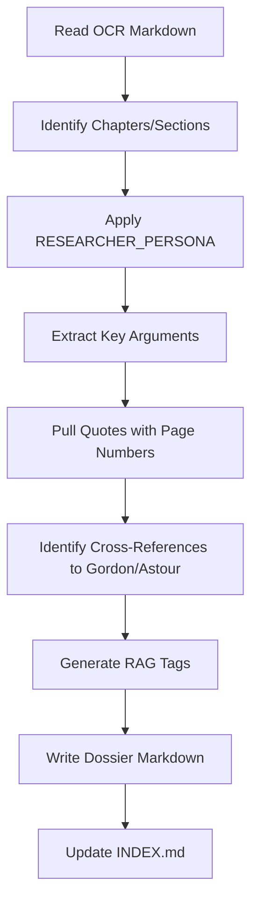

# Plan: Apply RESEARCHER_PERSONA to Extract Missing Scholarly Content

**Created**: 2025-01-17
**Status**: Draft
**Type**: Enhancement

---

## Overview

Apply the RESEARCHER_PERSONA methodology to extract vital scholarly information from Gordon, Astour, and Harrison source materials (`/Users/tomdimino/Desktop/Thera-Knossos-Minos-Paper/sources/`) that hasn't been captured in existing dossiers. Primary focus on **Harrison** (3 works with OCR but no dossiers) and **Rendsburg** (2 articles, no folder).

## Problem Statement

The Kothar RAG system currently has **1,205 chunks** from **61 dossier files** covering Gordon (13 works) and Astour (7 works). However:

| Scholar | Source Materials | Dossier Status | Gap |
|---------|-----------------|----------------|-----|
| **Harrison** | 3 works (40.4 MB) with OCR | ⚠️ PENDING - No dossiers created | HIGH |
| **Rendsburg** | 2 articles (2.7 MB) | ❌ NOT STARTED - No folder | MEDIUM |
| **Gordon Studies** | 1 volume (33.8 MB) | ❓ UNKNOWN - OCR status unclear | LOW |

Harrison's *Themis* (1912) is foundational for understanding ritual origins, the *Eniautos-Daimon* concept, and Cretan religious practices—all central to Kothar's oracle persona.

## Research Summary

### Source Material Inventory

```
sources/
├── harrison/
│   ├── Themis by Jane Ellen Harrison.pdf (35.0 MB)
│   ├── Themis by Jane Ellen Harrison.md (OCR ✅)
│   ├── Epilegomena by Jane Ellen Harrison.pdf (2.2 MB)
│   ├── Harrison-Epilegomena-mistral.md (OCR ✅)
│   ├── Harrison-KouretesZeusKouros-1908.pdf (3.2 MB)
│   └── Harrison-KouretesZeusKouros-1908-mistral.md (OCR ✅)
│
├── rendsburg/
│   ├── Rendsburg-BlackAthenaEtymological-1989.pdf (0.6 MB)
│   └── Rendsburg-SomeoneSucceedDeciphering-1996.pdf (2.1 MB)
│
└── gordon/
    └── Gordon_Studies_1933-1982.pdf (33.8 MB) [OCR status unknown]
```

### RESEARCHER_PERSONA Methodology

From `/souls/minoan/dossiers/RESEARCHER_PERSONA.md`:

1. **Primary sources first** - Full engagement with monographs
2. **Quote extraction with page numbers** - `(Author Year: page)`
3. **Etymological precision** - Preserve `*qadm*`, `ṣml`, `tḥm` transliterations
4. **Cross-referencing** - Note scholarly lineage (Harrison → Gordon → Astour)
5. **RAG-friendly tagging** - Domain-specific metadata

### Best Practices for Scholarly RAG

| Aspect | Recommendation |
|--------|----------------|
| **Chunk size** | 500-800 tokens (preserves argument coherence) |
| **Chunking method** | Section-based using Markdown headers |
| **Overlap** | 10-20% between consecutive chunks |
| **Metadata** | content_type, evidence_type, domain_tags |
| **Cross-references** | Bidirectional links between related dossiers |

### VoyageAI Considerations

- **Current setup is correct**: voyage-4-large for documents, voyage-4-lite for queries
- **Preserve transliterations**: Keep Hebrew, Greek, Ugaritic characters together
- **Don't split tables**: Lexicon entries stay as complete chunks

---

## Proposed Solution

### Phase 1: Harrison Dossier Creation (Priority: CRITICAL)

Create dossiers for Harrison's 3 major works using existing OCR markdown.

#### Files to Create

```
souls/minoan/dossiers/scholarly-sources/harrison/
├── INDEX.md                           # Scholar overview
├── themis/
│   ├── INDEX.md                       # Book overview + chapter list
│   ├── ch1-hymn-of-kouretes.md       # ~2,000-4,000 tokens each
│   ├── ch2-dromenon-drama.md
│   ├── ch3-dithyramb-sacrament.md
│   ├── ch4-olympian-chthonic.md
│   ├── ch5-olympic-games.md
│   ├── ch6-anthesteria.md
│   ├── ch7-thesmophoria.md
│   ├── ch8-year-daemon.md            # CRITICAL: Eniautos-Daimon concept
│   ├── ch9-initiation.md
│   ├── ch10-orpheus.md
│   ├── ch11-epilogue.md
│   └── murray-excursus.md            # Gilbert Murray's contribution
├── epilegomena-1921.md
└── kouretes-zeus-kouros-1908.md
```

#### Extraction Workflow



#### Estimated Chunks

| Work | Est. Chapters | Est. Chunks | Est. Tokens |
|------|---------------|-------------|-------------|
| Themis | 12 | ~150 | ~75,000 |
| Epilegomena | 1 | ~20 | ~10,000 |
| Kouretes article | 1 | ~15 | ~7,500 |
| **Total** | 14 | **~185** | **~92,500** |

### Phase 2: Rendsburg Folder Creation (Priority: MEDIUM)

Create folder structure and dossiers for Rendsburg's 2 articles on Gordon's decipherment.

#### Files to Create

```
souls/minoan/dossiers/scholarly-sources/rendsburg/
├── INDEX.md
├── black-athena-etymological-1989.md
└── someone-succeed-deciphering-1996.md
```

#### Estimated Chunks

| Work | Est. Chunks | Est. Tokens |
|------|-------------|-------------|
| Black Athena Etymological | ~10 | ~5,000 |
| Someone Will Succeed | ~15 | ~7,500 |
| **Total** | **~25** | **~12,500** |

### Phase 3: Gordon Studies Analysis (Priority: LOW)

Assess Gordon's collected *Studies (1933-1982)* volume for additional relevant papers.

**Prerequisites**:
- [ ] Verify OCR exists (check for `Gordon_Studies_1933-1982-mistral.md` or similar)
- [ ] If no OCR, run OCR extraction (2-4 hours)
- [ ] Review table of contents to identify relevant articles

**Defer until**: Phases 1 & 2 complete

---

## Technical Approach

### Dossier Template

```markdown
# [Chapter/Article Title]

## Source
- **Type**: Book Chapter | Journal Article
- **From**: [Book/Journal name]
- **Author**: Jane Ellen Harrison (1850-1928)
- **Date**: 1912
- **Pages**: pp. XX-XX
- **Citation**: Harrison, J.E. (1912). *Themis: A Study of the Social Origins of Greek Religion*. Cambridge University Press.

## Overview
[2-3 sentence summary with significance for Kothar's knowledge]

## Key Arguments

### [Argument 1 Title]
[Explanation with supporting evidence]
- Key quote: "[exact quote]" (p. XX)

### [Argument 2 Title]
...

## Notable Passages

> "[Significant quote]" (p. XX)
> — Context: [Why it matters for Kothar]

## Concepts Introduced

| Term | Definition | Source Language |
|------|------------|-----------------|
| *Eniautos-Daimon* | Year-spirit; vegetation deity who dies and revives | Greek concept |

## Cross-References

- **Internal**: [[gordon/ugarit-minoan-crete-ch3]]
- **External**: [[astour/hellenosemitica/ch2-cadmos]]
- **Scholarly lineage**: Builds on Frazer's *Golden Bough*, influences Gordon's ritual interpretations

## RAG Tags
harrison, themis, ritual, eniautos-daimon, kouretes, initiation, cretan, greek-religion, vegetation-deity
```

### Chunking Strategy

1. **Primary unit**: Each dossier file = 1 retrieval chunk group
2. **Secondary unit**: `## Key Arguments` sections as sub-chunks
3. **Preserve integrity**: Never split tables, block quotes, or argument chains
4. **Overlap**: 10% token overlap between consecutive argument sections

### Re-indexing Process

After dossier creation:

```bash
# 1. Chunk new dossiers
npx tsx scripts/chunk-dossiers.ts

# 2. Ingest to Supabase
source .env && export $(grep -v '^#' .env | xargs)
npx tsx scripts/ingest-embeddings.ts

# 3. Verify count
curl -s "https://pbdxprhibaawzwqovguv.supabase.co/rest/v1/kothar_dossiers?select=id" \
  -H "apikey: $SUPABASE_ANON_KEY" | jq length
```

---

## Acceptance Criteria

### Functional Requirements

- [ ] Harrison `INDEX.md` created with complete scholar overview
- [ ] All 12 Themis chapters extracted as individual dossiers
- [ ] Epilegomena and Kouretes article dossiers created
- [ ] Rendsburg folder created with 2 article dossiers
- [ ] All dossiers follow RESEARCHER_PERSONA methodology
- [ ] All quotes include page numbers where OCR preserves them
- [ ] Cross-references link to existing Gordon/Astour dossiers
- [ ] RAG tags cover key concepts (eniautos-daimon, kouretes, initiation, etc.)

### Quality Gates

- [ ] Each dossier has ≥3 key arguments with supporting quotes
- [ ] Each dossier has ≥5 RAG-friendly tags
- [ ] No tables split across chunks
- [ ] Transliterations preserved exactly (Greek, Hebrew, reconstructed forms)
- [ ] INDEX files list all child dossiers with chunk estimates

### Verification

- [ ] Re-run chunking script: `npx tsx scripts/chunk-dossiers.ts`
- [ ] Re-run ingestion: `npx tsx scripts/ingest-embeddings.ts`
- [ ] Verify new chunk count: ~1,205 + 185 + 25 = **~1,415 chunks**
- [ ] Test retrieval: Query "What is the Eniautos-Daimon?" returns Harrison content

---

## Dependencies & Risks

### Dependencies

| Dependency | Status | Mitigation |
|------------|--------|------------|
| Harrison OCR files | ✅ Available | None needed |
| Rendsburg OCR files | ⚠️ May need OCR | Run Mistral OCR if missing |
| Gordon Studies OCR | ❓ Unknown | Defer to Phase 3 |
| Supabase kothar_dossiers table | ✅ Created | None needed |
| VoyageAI API quota | ✅ Free tier (200M tokens) | ~100K tokens needed |

### Risks

| Risk | Probability | Impact | Mitigation |
|------|-------------|--------|------------|
| Page numbers lost in OCR | Medium | Medium | Cross-reference PDF for critical quotes |
| Themis too large (35 MB) | Low | Low | Chapter-by-chapter extraction |
| Harrison references obscure works | Medium | Low | Note as "[citation needed]" for future |
| Transliteration inconsistency | Medium | Medium | Document variants in Concepts table |

---

## Resource Estimates

### Time

| Phase | Estimated Hours |
|-------|-----------------|
| Phase 1: Harrison (3 works) | 4-6 hours |
| Phase 2: Rendsburg (2 articles) | 1-2 hours |
| Phase 3: Gordon Studies (assessment) | 1 hour |
| Re-indexing & verification | 0.5 hours |
| **Total** | **6.5-9.5 hours** |

### Cost

| Resource | Usage | Cost |
|----------|-------|------|
| VoyageAI embeddings | ~105K tokens | $0.013 (free tier) |
| Supabase storage | ~1MB additional | Free tier |
| **Total** | - | **~$0** |

---

## Open Questions

1. **Page number format**: Do Harrison OCR files preserve page numbers? If not, strategy for critical quotes?

2. **Cross-reference updates**: When Harrison references Gordon, should Gordon dossiers get backlinks?

3. **Transliteration normalization**: Preserve author's original or normalize to standard Unicode?

4. **Duplicate quotes**: If Harrison quotes Gordon verbatim, keep in both dossiers or reference only?

---

## References

### Internal
- `/souls/minoan/dossiers/RESEARCHER_PERSONA.md` - Extraction methodology
- `/souls/minoan/dossiers/scholarly-sources/gordon/INDEX.md` - Reference structure
- `/scripts/chunk-dossiers.ts` - Chunking pipeline
- `/scripts/ingest-embeddings.ts` - Embedding ingestion

### External
- [VoyageAI Documentation](https://docs.voyageai.com/docs/embeddings)
- [Late Chunking for RAG](https://arxiv.org/abs/2409.04701)
- [Academic RAG Best Practices](https://arxiv.org/abs/2501.07391)
